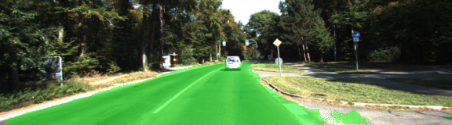
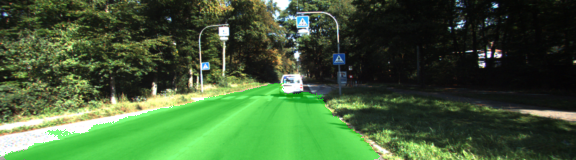
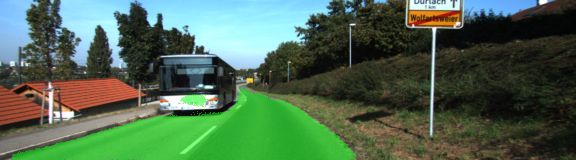
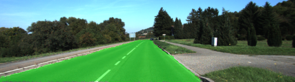
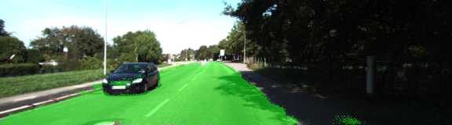
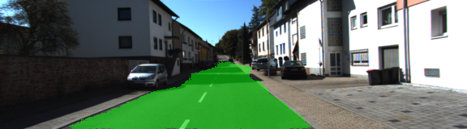

# Semantic Segmentation - Florian Wulff

---



---

## Writeup
In this project, a fully convolutional networks is used to label the pixels of a road in images.

### Dataset
Download the [Kitti Road dataset](http://www.cvlibs.net/datasets/kitti/eval_road.php) from [here](http://www.cvlibs.net/download.php?file=data_road.zip).  Extract the dataset in the `data` folder.  This will create the folder `data_road` with all the training a test images.

The Kitti Road dataset contains 289 training images and annotated ground truth images for the road area / pixels. A test set of 290 images is given as well.
Current benchmark top entries achieve a Fmax score of > 96%. [Leaderboard] (http://www.cvlibs.net/datasets/kitti/eval_road.php)

### FCN Network

A Fully Convolutional Network (FCN) is trained to label each pixel into 2 classes (binary) - this can be done by the following three approaches:

* 1x1 convolutions
* Skip layers to concatenate low level and high level features / convolutions
* Upsampling oder Deconvolution using transposed convolution to restore the original input image size

A pretrained VGG16 network is used as the encoder, where all fully connected layers are removed and upsampling and skip connections are added.

    def load_vgg(sess, vgg_path):
    """
    Load Pretrained VGG Model into TensorFlow.
    :param sess: TensorFlow Session
    :param vgg_path: Path to vgg folder, containing "variables/" and "saved_model.pb"
    :return: Tuple of Tensors from VGG model (image_input, keep_prob, layer3_out, layer4_out, layer7_out)
    """

    #   Use tf.saved_model.loader.load to load the model and weights
    vgg_tag = 'vgg16'
    
    tf_graph = tf.get_default_graph()
    
    tf.saved_model.loader.load(sess, [vgg_tag], vgg_path)
    
    # print names of elements in graph
    #for element in tf_graph.get_operations():
    #    print(element.name)
        
    # define names
    vgg_input_tensor_name = 'image_input:0'
    vgg_keep_prob_tensor_name = 'keep_prob:0'
    vgg_layer3_out_tensor_name = 'layer3_out:0'
    vgg_layer4_out_tensor_name = 'layer4_out:0'
    vgg_layer7_out_tensor_name = 'layer7_out:0'
    
    # load VGG pretrained graphs by name
    tf_input = tf_graph.get_tensor_by_name(vgg_input_tensor_name)
    tf_prob = tf_graph.get_tensor_by_name(vgg_keep_prob_tensor_name)
    tf_layer3 = tf_graph.get_tensor_by_name(vgg_layer3_out_tensor_name)
    tf_layer4 = tf_graph.get_tensor_by_name(vgg_layer4_out_tensor_name)
    tf_layer7 = tf_graph.get_tensor_by_name(vgg_layer7_out_tensor_name)
    
    return tf_input, tf_prob, tf_layer3, tf_layer4, tf_layer7

The network is defined in:

    def layers(vgg_layer3_out, vgg_layer4_out, vgg_layer7_out, num_classes):
    """
    Create the layers for a fully convolutional network.  Build skip-layers using the vgg layers.
    :param vgg_layer7_out: TF Tensor for VGG Layer 3 output
    :param vgg_layer4_out: TF Tensor for VGG Layer 4 output
    :param vgg_layer3_out: TF Tensor for VGG Layer 7 output
    :param num_classes: Number of classes to classify
    :return: The Tensor for the last layer of output
    """
    
    # create the network
    # use layers conv2d 1x1 kernel, conv2d_transpose, skip connections
    
    # encoder is vgg network

    # 1x1 convolutions for skip connections
    conv1x1_layer7 = tf.layers.conv2d(vgg_layer7_out, num_classes, 1, strides = (1,1), padding='same') 
    conv1x1_layer4 = tf.layers.conv2d(vgg_layer4_out, num_classes, 1, strides = (1,1), padding='same')
    conv1x1_layer3 = tf.layers.conv2d(vgg_layer3_out, num_classes, 1, strides = (1,1), padding='same')
    
    # conv2transpose deconvolutions to scale up and concatenation with skip connections
    # after each upscaling, do conv2d but without changing dimensions
    # upscaling is mirrored conv2d downsampling path (number of convolutions and resolutions)
    
    # first upscaling layer
    deconv_layer7 = tf.layers.conv2d_transpose(conv1x1_layer7, num_classes,  4, strides=(2, 2), padding='same')
    skip_layer7 = tf.add(deconv_layer7, conv1x1_layer4)
    
    # second upscaling layer
    deconv_layer4 = tf.layers.conv2d_transpose(skip_layer7, num_classes,  4, strides=(2, 2), padding='same')
    skip_layer4 = tf.add(deconv_layer4, conv1x1_layer3)
    
    output = tf.layers.conv2d_transpose(skip_layer4, num_classes,  16, strides=(8, 8), padding='same')

    return output

### Optimizer and loss function

As the optimizer, ADAM is used with a learning rate of 1e-4. The loss is calculated using cross-entropy with logits for 2 classes.

    def optimize(nn_last_layer, correct_label, learning_rate, num_classes):
    """
    Build the TensorFLow loss and optimizer operations.
    :param nn_last_layer: TF Tensor of the last layer in the neural network
    :param correct_label: TF Placeholder for the correct label image
    :param learning_rate: TF Placeholder for the learning rate
    :param num_classes: Number of classes to classify
    :return: Tuple of (logits, train_op, cross_entropy_loss)
    """
    
    # define optimizer for training
    logits = tf.reshape(nn_last_layer, (-1, num_classes))
    labels = tf.reshape(correct_label, (-1, num_classes))
    cross_entropy_loss = tf.reduce_mean(tf.nn.softmax_cross_entropy_with_logits(logits=logits, labels=labels))
    train_op = tf.train.AdamOptimizer(learning_rate).minimize(cross_entropy_loss)
    
    return logits, train_op, cross_entropy_loss
    
### Training

Training is done for 50 epochs, a resolution of 576, 160 px  learning rate of 1e-4 and at a batch size of 2 (TITAN X GPU with 12GB RAM used) in:

    def train_nn(sess, epochs, batch_size, get_batches_fn, train_op, cross_entropy_loss, input_image,
             correct_label, keep_prob, learning_rate):
    """
    Train neural network and print out the loss during training.
    :param sess: TF Session
    :param epochs: Number of epochs
    :param batch_size: Batch size
    :param get_batches_fn: Function to get batches of training data.  Call using get_batches_fn(batch_size)
    :param train_op: TF Operation to train the neural network
    :param cross_entropy_loss: TF Tensor for the amount of loss
    :param input_image: TF Placeholder for input images
    :param correct_label: TF Placeholder for label images
    :param keep_prob: TF Placeholder for dropout keep probability
    :param learning_rate: TF Placeholder for learning rate
    """
    
    # run training for defined number of epochs with defined parameters
    for epoch in range(epochs):
        for curr_batch, (curr_image, curr_label) in enumerate(get_batches_fn(batch_size)):
            history, curr_loss = sess.run([train_op, cross_entropy_loss],
                                          feed_dict = {input_image: curr_image, 
                                                       correct_label: curr_label, 
                                                       keep_prob: 0.5, 
                                                       learning_rate: 1e-4})
            print("curr batch", curr_batch, "curr epoch ", epoch, "/", epochs, "curr loss ", curr_loss)
    
    pass

### Results

The training loss is decreasing continously to a value of approx. 0.02.
The resulting road segmentation is showing excellent results, labelling a majority > 90% of road pixels correct and less than 10% of non road pixels incorrect.

Anyway, this is still far away from the current state of the art benchmark. 

Here are some test images:









```python

```
